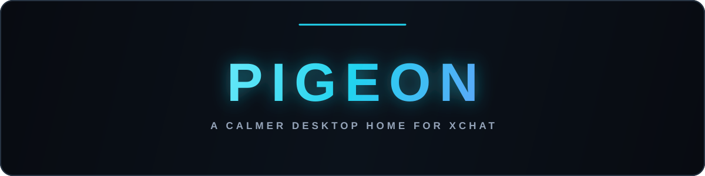

<p align="center">
  
</p>

<p align="center">
  
</p>

<p align="center">
  <strong>A focused, privacy-minded desktop client for XChat.</strong><br>
  Made for conversations — not for the endless feed.
</p>

<p align="center">
  
  
  
  
</p>

<p align="center">
  <a href="#english">🇬🇧 English</a>&nbsp;&nbsp;•&nbsp;&nbsp;<a href="#русский">🇷🇺 Русский</a>
</p>

<br>

<a id="english"></a>

## 🇬🇧 English

Pigeon brings the official XChat web experience into a quieter desktop space. It stays out of the way, respects your system, and adds the details that make daily messaging feel better.

> **Unofficial project.** Pigeon is not affiliated with X Corp and uses the official X sign-in flow.

### What feels better

| | |
| :-- | :-- |
| **Native notifications** | Desktop alerts, tray badge, and configurable sounds for incoming messages. |
| **Privacy Blur** | Hide message previews until hover. Toggle with `Ctrl` + `Shift` + `P`. |
| **Boss Key** | Instantly hide Pigeon to the tray with `Ctrl` + `Alt` + `H`. |
| **Message shortcuts** | Right-click a message for its action menu; double-click to reply. |
| **File-friendly chat** | Drag files into a conversation and paste text or images reliably. |
| **Calm by default** | Soft feedback, optional reduced motion, no flashy or intrusive animations. |
| **Private reset** | Sign out and clear X cookies, local storage, and cached media from Settings. |

### Install

<table>
  <tr>
    <td width="50%" valign="top">
      <h4>Windows</h4>
      Download <code>Pigeon-Setup.exe</code> from the latest release and run it.<br><br>
      To update, run the newer installer over the existing installation. <strong>Do not uninstall first</strong> — your Pigeon settings and data stay in place.
    </td>
    <td width="50%" valign="top">
      <h4>Linux</h4>
      Download the AppImage from the latest release, then run:<br><br>
      <code>chmod +x Pigeon-*.AppImage</code><br>
      <code>./Pigeon-*.AppImage</code>
    </td>
  </tr>
</table>

### Build locally

```bash
npm install
npm run build:linux   # AppImage
npm run build:win     # NSIS installer
```

Pigeon uses the official X web experience inside Electron. **Sign out and clear cache** removes the X session, cookies, local storage, and cached media kept by Pigeon; manually saved Downloads are never touched.

---

<a id="русский"></a>

## 🇷🇺 Русский

Pigeon переносит официальный веб-интерфейс XChat в спокойное десктоп-приложение. Ничего лишнего: только чаты, нативные возможности компьютера и удобные мелочи для ежедневной переписки.

> **Неофициальный проект.** Pigeon не связан с X Corp и использует официальный сценарий входа X.

### Что стало лучше

| | |
| :-- | :-- |
| **Нативные уведомления** | Системные уведомления, бейдж в трее и настраиваемые звуки новых сообщений. |
| **Privacy Blur** | Скрывает предпросмотр сообщений до наведения. Включается через `Ctrl` + `Shift` + `P`. |
| **Boss Key** | Мгновенно прячет Pigeon в трей по `Ctrl` + `Alt` + `H`. |
| **Быстрые действия** | Правый клик открывает меню сообщения, двойной клик отвечает на него. |
| **Удобная работа с файлами** | Перетаскивание файлов в чат и надёжная вставка текста или изображений. |
| **Спокойный интерфейс** | Мягкая обратная связь, настройка «Уменьшить анимации», никаких навязчивых эффектов. |
| **Очистка сессии** | Выход из X с удалением cookies, локальных данных и кэшированных медиа в настройках. |

### Установка

<table>
  <tr>
    <td width="50%" valign="top">
      <h4>Windows</h4>
      Скачай <code>Pigeon-Setup.exe</code> из последнего релиза и запусти его.<br><br>
      Для обновления установи новую версию поверх старой. <strong>Удалять Pigeon заранее не нужно</strong> — настройки и данные сохранятся.
    </td>
    <td width="50%" valign="top">
      <h4>Linux</h4>
      Скачай AppImage из последнего релиза, затем выполни:<br><br>
      <code>chmod +x Pigeon-*.AppImage</code><br>
      <code>./Pigeon-*.AppImage</code>
    </td>
  </tr>
</table>

### Сборка из исходников

```bash
npm install
npm run build:linux   # AppImage
npm run build:win     # установщик NSIS
```

Кнопка **«Выйти и удалить кэш»** очищает сессию X, cookies, локальное хранилище сайта и кэшированные медиа Pigeon. Файлы, вручную сохранённые в системную папку «Загрузки», не удаляются.

<p align="center"><sub>Made with care for quieter conversations.</sub></p>
